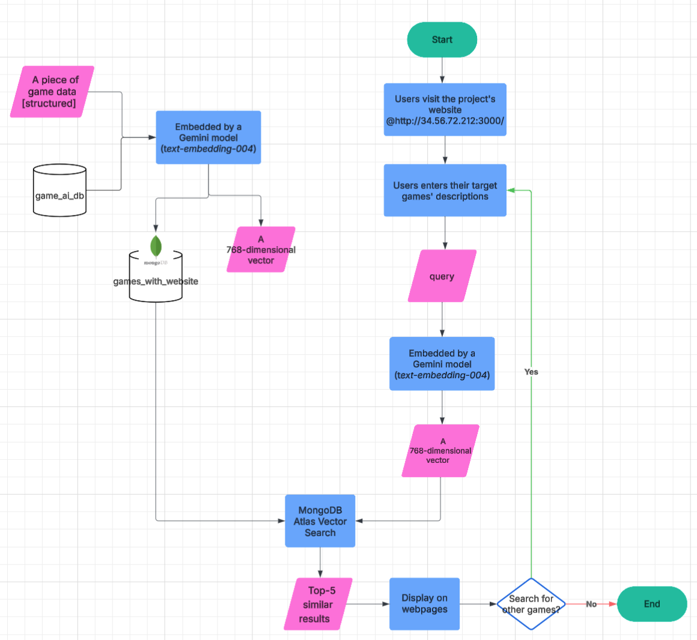

# Project Introduction
This project is a web-based application that allows users to explore and discover games through **semantic search**. Instead of relying on keyword matching, the system uses **natural language understanding** to return games that are **contextually and semantically similar to user queries**.

Users can input free-text descriptions of what they're looking for (e.g., “open-world adventure with strong storyline”), and the system returns a ranked list of games that match the intent, not just the keywords.

## The project Pipeline
The project pipeline is shown below:

## 🧠 Key Features
- 🔍 Semantic Search for games based on user descriptions

- 💬 Natural Language Embeddings generated from both game descriptions and user queries

- 🧭 Vector Space Similarity Search using k-nearest neighbor (k-NN)

- ⚡ Fast and Scalable Querying over a large dataset

- 🌐 Modern Frontend UI with interactive search and result display

## 🧱 Tech Stack

| Component         | Technology                | Purpose                                      |
|-------------------|---------------------------|----------------------------------------------|
| Frontend          | Next.js (React)           | User interface, server-side rendering, routing |
| Backend           | Node.js API routes        | Request handling, embedding and DB access   |
| Embedding Service | Gemini API (text-embedding-004) | Generate 768-dimension semantic embeddings  |
| Database & Search | MongoDB Atlas with Vector Search | Stores game metadata and embeddings, performs similarity search |

## ⚙️ How It Works (Summary Flow)

1. A user enters a natural language query.

2. The query is passed to Gemini's `text-embedding-004` to produce an embedding vector.

3. This vector is used to query MongoDB Atlas Vector Search, which returns the most semantically similar game entries.

4. The results are returned to the frontend and displayed in a user-friendly interface.
